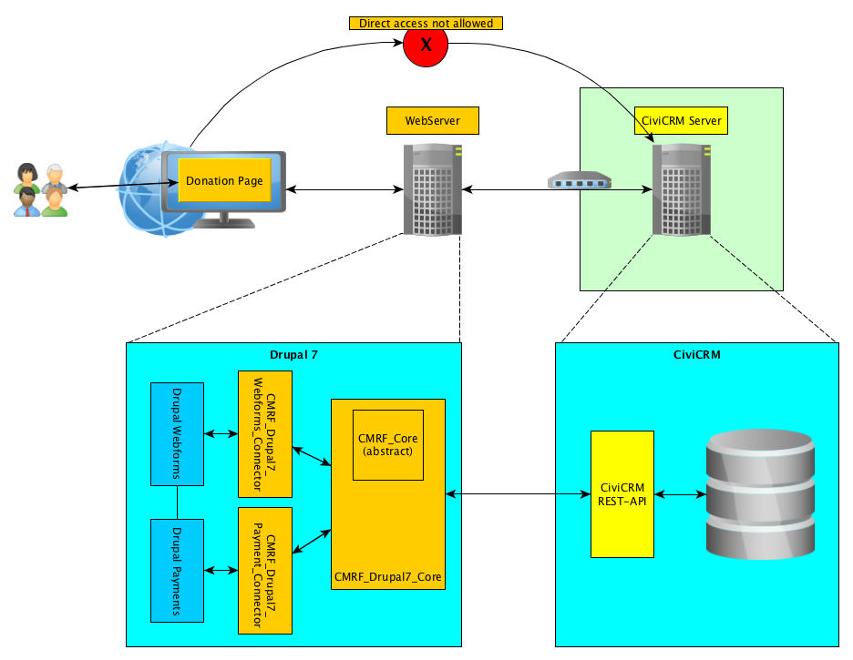
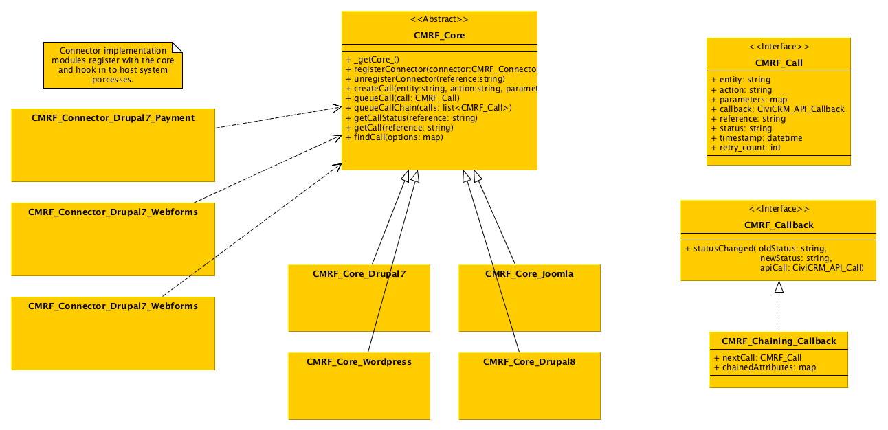

# CMRF Project

CMRF is the CiviCRM Modular Remote-Access Framework. The project aims at providing an infrastructure for the data exchange between a public facing website with a CiviCRM system.

There is a lot of options available to integrate CiviCRM when running on the *same* server (e.g. Drupal Webforms integration), but we believe that in many cases, CiviCRM should not be run on a publicly accessible webserver e.g.
1. When there are some serious concerns about data protection. A CRM system is often a trove of confidential information and is therefore probably better off safely hidden behind the firewall.
1. A public-facing website has to perform some tasks for many users. A CRM provides a lot of functionality, just for a few. This results in very different upgrade needs. The public nature of a website demands upgrading fast, and the limited functionality makes testing feasible. Upgrading CiviCRM is a time-consuming job because a lot of complex workflows must be checked, so it makes sense to minimise the number of upgrades. Separating the public website from CiviCRM makes it possible to cater for both upgrade needs.
1. Organisations can have more public websites that target different audiences but have to collect information in one CiviCRM instance.

The CRMF project set out facilitate the setup of an interactive, individual *and* secure interaction with your constituents using CiviCRM.

The project was started in May 2016 by Erik Hommel (erik.hommel/civicoop.org) and Björn Endres (endres/systopia.de). We're happy for any kind of support.

## Why the crude acronym?

The acronym CMRF was based on the working title "Civi McRest Face" (after the [Boaty McBoatface incident](http://www.theguardian.com/environment/2016/apr/17/boaty-mcboatface-wins-poll-to-name-polar-research-vessel)) We meant to emphasise public participation, and at the same time it contained the important key words of the project: **Civi**CRM connection to a public **fac**ing website via its **REST** API.

## Scenario

The following depicts a typical setup: 

## Structure

The heart of the project is the ``CMRF_Core``, where the basic infrastructure is implemented. Since the core has to be tightly ingrated into the host system (e.g. Drupal7, Drupal8, Wordpress, Joomla, etc.) the class is abstract and needs to be extended in order to be functional.

Linking individual functions or features of the host system (e.g. Webforms, payment systems, etc.) to the core is the the job of the ``CMRF_Connector`` projects. They register with a local core and ultimately connect CiviCRM with the host system, and *translate* between the two.

Here's a class diagram draft: 

